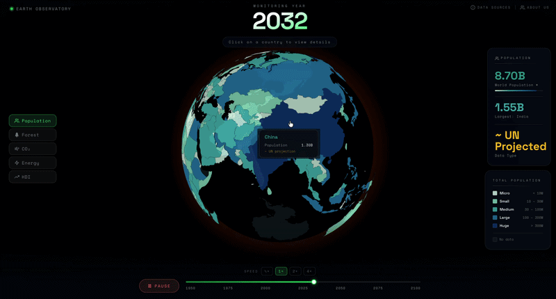

# Global Stats Monitor

An interactive 3D globe dashboard visualizing various dataset obtained from [Our World in Data](https://ourworldindata.org/search) trends across countries, inspired by [Pudding.cool](https://pudding.cool)'s storytelling approach.

<br/>

<div align="center" style="flex-direction: column;">
  
  <div style="font-size: 0.8em; color: gray;">Home Screen</div> 
</div> 

<br/>

## Data

The dashboard visualizes data from the [Food and Agriculture Organization of the United Nations (FAO)](https://www.fao.org/forest-resources-assessment/en/) via Our World in Data. The dataset includes:
- **Coverage**: 1990–2025
- **Metric**: Share of global forest area per country (% of total world forests)
- **Countries**: 190+ nations tracked
- **Source**: FAO Global Forest Resources Assessment 2025

<br/>

## Getting Started

#### Installation
```bash
npm install
```

#### Development
```bash
npm run dev
```

The application will open at [http://localhost:5173](http://localhost:5173)

#### Build
```bash
npm run build
```

<br/>

## Deployment

The app is configured for [GitHub Pages](https://pages.github.com/) at `https://sudip70.github.io/deforestation/`.

```bash
npm run deploy
```

